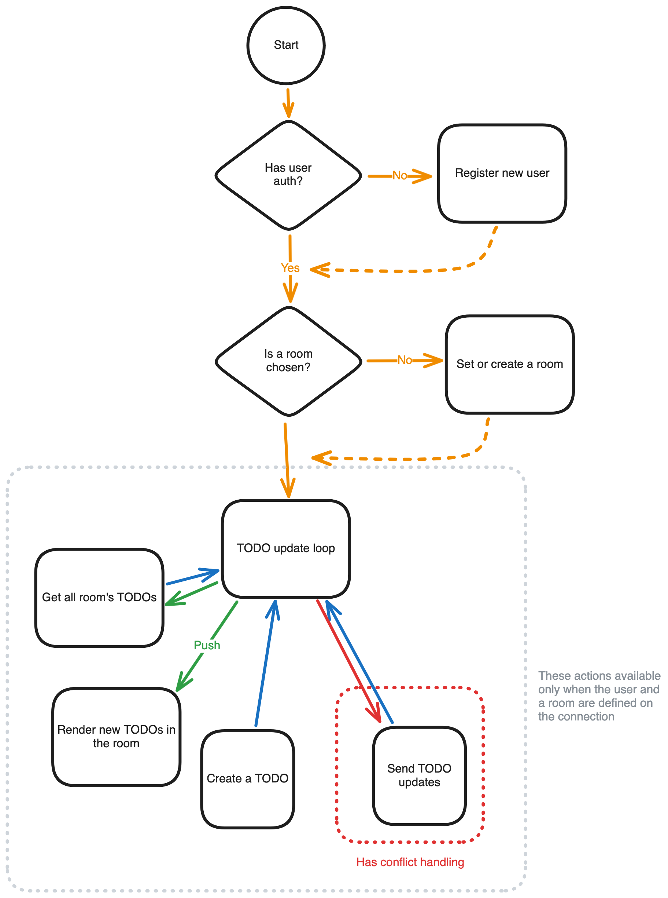

# TODO App for Poolside by Steponas Dauginis

Heya! 👋

This is the TODO App by Steponas Dauginis for Poolside technical interview.

I have written the interesting bits in README.md files in some of the folders.

## Folder Structure

```
client/ -- the Electron application. More docs there.
server/ -- the Express server and dockerized postgres.
           More docs there on how to run stuff.
types/ -- common TS types
common-utils/ -- common functions for both client and server
```

## Architecture

It's a
- Electron app for the client
- Express server for the backend
- Postgres for the database
- WebSockets for the communication between the client and the server
- Jest for testing

Here is the high-level architecture of the networking flow:


## Note on windows:
Technically the Client should build for Windows (as I've added the
configs in forge), but I have not tested it, as my own machine is
a Mac.

## Note on the Server:
The server is not dockerized, but ideally it should have been. But it
should run on any OS, as it's node - which does cross-platform well.
